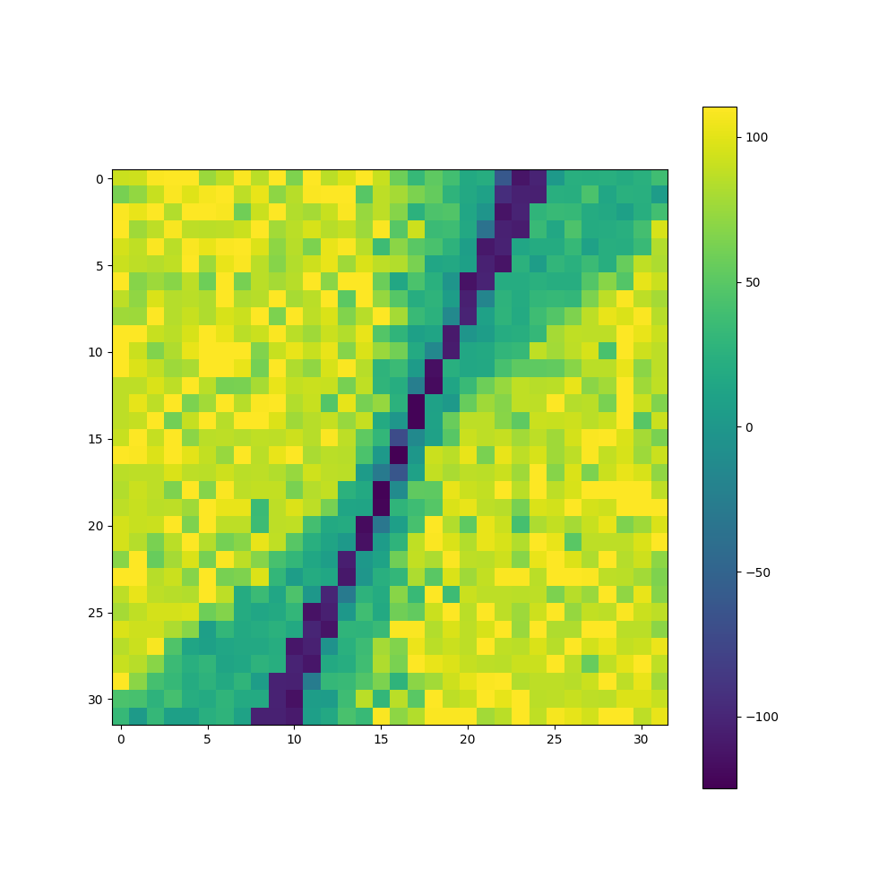

# Policy Generating Evolved Networks

<div align="center">
_PGENs_
</div>

PGENs are a way to evolve a meta-policy that in turn specifies a continuous distribution of policy parameters for an agent. PGENs are similar to and can be compared with generative adversarial networks, except that the generators are producing agent policy parameters instead of direct outputs, and while PGANs could use generator-discriminator pair to train, PGENs are selected purely based on the fitness of agent policies produced. 

After training, the fitness landscape over the latent space can then be mapped.

<div align="center">

_Fitness landscape over latent space for `InvertedPendulumSwingupBulletEnv-v0`_
</div>

In the first iteration of PGENs I used an MLP to transform a latent space into an array of parameters that are then used by a second MLP to act as the agent policy in an RL environment. This might seem a bit misguided at first glance as the meta-policy has _more_ parameters than the agent policy, so there are no compression benefits, and training costs more wall time as well. PGEN Training can be expected to take more than 10X as long as evolution of the agent policy directly. 

In exchange for a few more parameters and longer training time, a meta-policy can evolve to produce a continuous distribution of agent policies, the majority of which are effective at the task at hand. This yields a significant diversity of qualitatively distinct agent policies, which, for complex environments, may provide a competent repertoire to deal with different scenarios. 

<div align="center">

_A collection of agent policies specificed by a single meta-policy._
</div>

We could also design our PGEN architecture to yield compression benefits as well, for example by encoding the PGEN for a multilayer perceptron agent policy as a convolutional neural network or (and I hope to show some results on this soon) as a set of cellular automata rules. 

## Getting Started

Here is an example of how you might go about initializing a virtual environment and installing PGEN as a module.

```
virtualenv pgen_env --python=python3
source pgen_env/bin/activate

git clone https://github.com/rivesunder/PGEN.git
cd PGEN
pip install -e . 
```

After that, starting an experiment is pretty simple. Most aspects of training are hard-coded at the moment (commit 45e1c121), but you can specify the RL environment to train on and the maximum number of generations to train for. 

```
python -m pgen.pgen -n InvertedPendulumSwingupBulletEnv-v0 -g 2500
```


